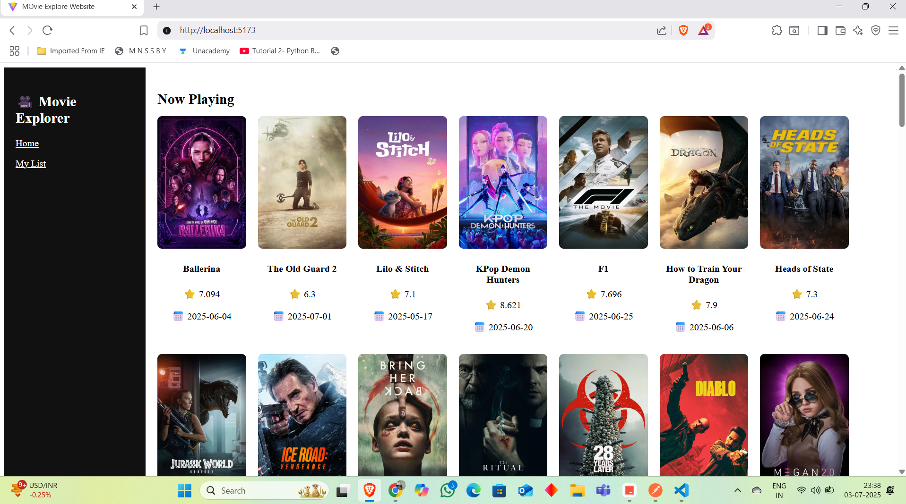

 # 🎬 Movie Explorer Website

A React + Vite-based app that uses the TMDB API to display latest, popular, top-rated, and upcoming movies.

## 🔧 Features
- React with Vite
- Material-UI for styling
- State management with useReducer
- API integration with TMDB (The Movie Database)
- Fallback to local JSON data if API fails
- My List with Local Storage
- Movie Details with Cast, Crew, Similar Movies

## 🧪 API and Postman
- Postman collection file: [`postman/movie-api-collection.json`](./postman/movie-api-collection.json)

## 🖼️ Preview


## 🛠️ Setup
1. Clone the repo
2. Install dependencies:
   ```bash
   npm install
